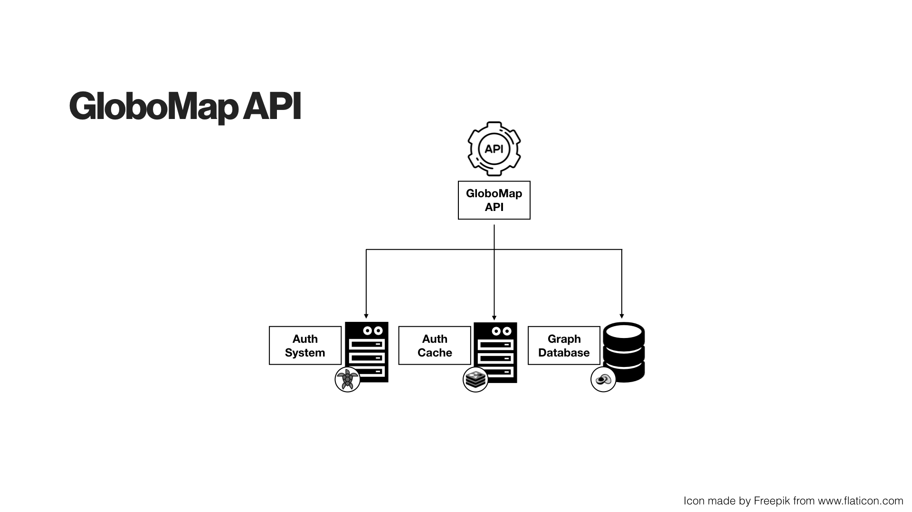

# GloboMap API

API responsible for storing and retrieving information in  [ArangoDB](https://arangodb.com/), the Globomap database.
As can be seen in the [general architecture](images/general_arch.jpeg), it is used by [WEB UI](https://github.com/globocom/globomap-ui), [LOADER](https://github.com/globocom/globomap-core-loader) and any application that wishes to consume information from the database.

